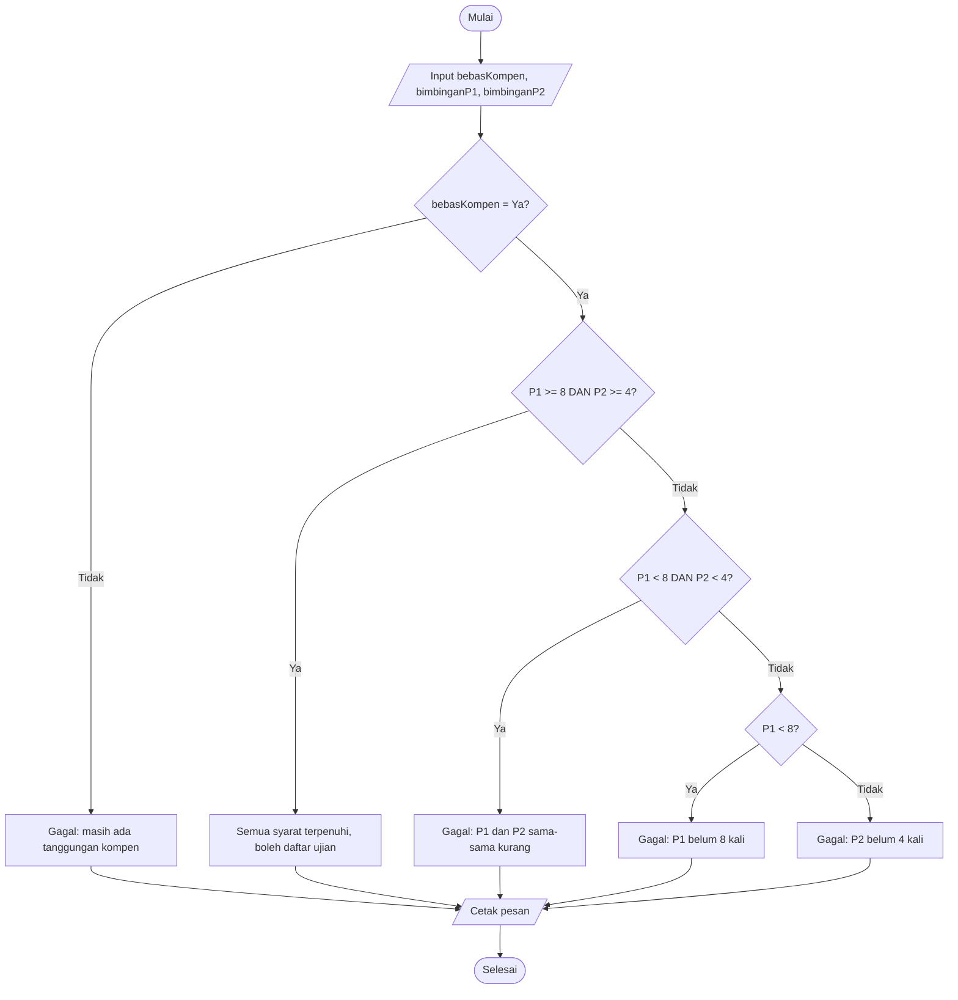
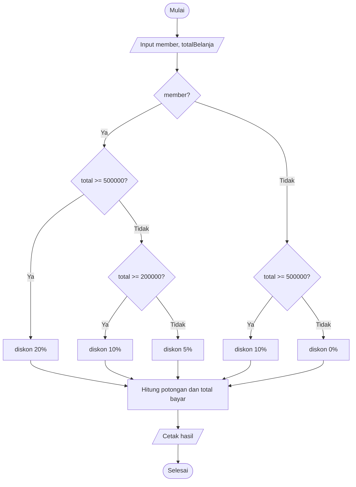

<div align="center">

# 📗 JOBSHEET 6 — PEMILIHAN 2

**Dasar Pemrograman 2026 · Politeknik Negeri Malang**

</div>

| | |
|---|---|
| 👤 **Nama** | Elia Beril |
| 🆔 **NIM** | 264107020027 |
| 🔢 **No. Presensi** | 13 |
| 📚 **Mata Kuliah** | Dasar Pemrograman |
| ☕ **Bahasa** | Java (diuji dengan OpenJDK 21) |

> 📝 Dokumen ini memuat **Pertanyaan** (Percobaan 1–3) dan **Tugas**. Langkah-langkah praktikum tidak diulang. Semua hasil *run* berasal dari program yang benar-benar dijalankan.

---

## 🗂️ Struktur Repositori

```text
jobsheet6/
├── experiment/                       → 3 file Percobaan
│   ├── nestedUjianSkripsi13exp.java
│   ├── operatorLogikaWifi13exp.java
│   └── nestedAksesLab13exp.java
├── assignment/                       → 2 file Tugas
│   ├── tugas1DiskonBuku13assign.java
│   └── tugas2SeleksiAsisten13assign.java
└── Jawaban_Jobsheet_6_Pemilihan_2.md (dokumen ini)
```

Klik nama file untuk membuka **kode asli** di repositori (tautan relatif, bekerja bila dokumen ini berada di folder `jobsheet6`).

| No | Folder | File |
|:-:|---|---|
| 1 | `experiment/` | [`nestedUjianSkripsi13exp.java`](experiment/nestedUjianSkripsi13exp.java) |
| 2 | `experiment/` | [`operatorLogikaWifi13exp.java`](experiment/operatorLogikaWifi13exp.java) |
| 3 | `experiment/` | [`nestedAksesLab13exp.java`](experiment/nestedAksesLab13exp.java) |
| 4 | `assignment/` | [`tugas1DiskonBuku13assign.java`](assignment/tugas1DiskonBuku13assign.java) |
| 5 | `assignment/` | [`tugas2SeleksiAsisten13assign.java`](assignment/tugas2SeleksiAsisten13assign.java) |

---

## 📑 Daftar Isi

1. [Percobaan 1 — Nested IF (Ujian Skripsi)](#1-percobaan-1--nested-if-ujian-skripsi)
2. [Percobaan 2 — Operator Logika (WiFi Kampus)](#2-percobaan-2--operator-logika-wifi-kampus)
3. [Percobaan 3 — Nested IF + Operator Logika (Lab)](#3-percobaan-3--nested-if--operator-logika-akses-lab)
4. [Tugas](#4-tugas)
5. [Lampiran — Kode Lengkap](#5-lampiran--kode-lengkap-semua-file)
6. [Catatan Asumsi](#6-catatan-asumsi)

---

# 1. Percobaan 1 — Nested IF (Ujian Skripsi)

📄 File: [`nestedUjianSkripsi13exp.java`](experiment/nestedUjianSkripsi13exp.java)

**Hasil run sesuai contoh jobsheet** (input `ya`, 6, 5):
```text
Apakah mahasiswa sudah bebas kompen? (Ya/Tidak): ya
Masukkan jumlah log bimbingan Pembimbing 1: 6
Masukkan jumlah log bimbingan Pembimbing 2: 5
Gagal! Log bimbingan P1 belum mencapai 8 kali
```

### ❓ Pertanyaan 1
**Apa yang terjadi jika mahasiswa menjawab "No" pada pertanyaan bebas kompen? Mengapa demikian?**

```text
Apakah mahasiswa sudah bebas kompen? (Ya/Tidak): No
Masukkan jumlah log bimbingan Pembimbing 1: 10
Masukkan jumlah log bimbingan Pembimbing 2: 5
Gagal! Mahasiswa masih memiliki tanggungan kompen
```

Program langsung menampilkan **"Gagal! Mahasiswa masih memiliki tanggungan kompen"**, **berapa pun** jumlah log bimbingannya (pada contoh di atas P1 = 10 dan P2 = 5 sebenarnya sudah cukup).

**Alasannya:** kondisi level pertama `bebasKompen.equalsIgnoreCase("Ya")` bernilai `false` karena `"No"` bukan `"Ya"`. Akibatnya seluruh blok di dalam IF pertama (yang memeriksa log bimbingan) **dilewati** dan program masuk ke `else` terluar. Kompen adalah syarat administrasi yang harus dipenuhi lebih dulu. Selama belum terpenuhi, log bimbingan tidak ikut menentukan hasil.

> 💡 Perhatikan juga bahwa **semua teks selain "Ya"** (misalnya `Tidak`, `iya`, atau salah ketik) diperlakukan sama, yaitu belum bebas kompen. Perbandingannya memakai `equalsIgnoreCase`, jadi `ya`, `YA`, dan `Ya` semuanya diterima.

### ❓ Pertanyaan 2
**Jelaskan maksud dari `if (bimbinganP1 >= 8 && bimbinganP2 >= 4) {`**

Kondisi ini terdiri dari dua perbandingan yang digabung operator **AND (`&&`)**:

| Bagian | Arti |
|---|---|
| `bimbinganP1 >= 8` | bimbingan dengan Pembimbing 1 minimal 8 kali |
| `bimbinganP2 >= 4` | bimbingan dengan Pembimbing 2 minimal 4 kali |
| `&&` | **kedua** perbandingan harus `true` secara bersamaan |

Blok ini hanya dijalankan bila **kedua syarat terpenuhi**, dan hasilnya adalah pesan *"Semua syarat terpenuhi. Mahasiswa boleh mendaftar ujian skripsi"*. Bila salah satu saja `false`, kondisi menjadi `false` dan program lanjut memeriksa `else if` berikutnya untuk mencari tahu bimbingan mana yang kurang.

### ❓ Pertanyaan 3
**Bagaimana alur pemeriksaan syarat dari awal sampai akhir untuk semua kondisi?**



**Penjelasan runtut:**

1. Program membaca `bebasKompen`, `bimbinganP1`, dan `bimbinganP2` dari keyboard.
2. **Level 1 (administrasi):** jika `bebasKompen` bukan "Ya", pesan *tanggungan kompen* ditampilkan dan pemeriksaan **berhenti**.
3. **Level 2 (log bimbingan)**, hanya bila kompen sudah bebas, diperiksa berurutan:
   - P1 ≥ 8 **dan** P2 ≥ 4 → semua syarat terpenuhi, boleh mendaftar.
   - P1 < 8 **dan** P2 < 4 → kedua pembimbing kurang.
   - P1 < 8 (berarti P2 sudah ≥ 4, karena kondisi sebelumnya gagal) → hanya P1 yang kurang.
   - Selain itu (`else`) → hanya P2 yang kurang.
4. Satu pesan ditampung di `pesan`, lalu dicetak dengan `System.out.println(pesan)`.

**Bukti untuk setiap kemungkinan:**

| Bebas kompen | P1 | P2 | Keluaran |
|:-:|:-:|:-:|---|
| Ya | 8 | 4 | Semua syarat terpenuhi. Mahasiswa boleh mendaftar ujian skripsi |
| Ya | 3 | 2 | Gagal! Log bimbingan P1 kurang dari 8 kali dan P2 kurang dari 4 kali |
| Ya | 6 | 5 | Gagal! Log bimbingan P1 belum mencapai 8 kali |
| Ya | 9 | 2 | Gagal! Log bimbingan P2 belum mencapai 4 kali |
| No | 10 | 5 | Gagal! Mahasiswa masih memiliki tanggungan kompen |

---

# 2. Percobaan 2 — Operator Logika (WiFi Kampus)

📄 File: [`operatorLogikaWifi13exp.java`](experiment/operatorLogikaWifi13exp.java)

**Contoh run (pengguna dosen):**
```text
Apakah pengguna mahasiswa? (true/false): false
Apakah pengguna dosen? (true/false): true
Apakah akun sedang diblokir? (true/false): false
Akses WiFi diberikan
```

**Hasil uji 4 kombinasi:**

| Uji | mahasiswa | dosen | akunDiblokir | Hasil dengan `\|\|` (asli) | Hasil dengan `&&` (Pertanyaan 3) |
|:-:|:-:|:-:|:-:|---|---|
| 1 | true | false | false | Akses WiFi diberikan | Akses WiFi ditolak |
| 2 | false | true | false | Akses WiFi diberikan | Akses WiFi ditolak |
| 3 | true | false | true | Akses WiFi ditolak | Akses WiFi ditolak |
| 4 | false | false | false | Akses WiFi ditolak | Akses WiFi ditolak |

### ❓ Pertanyaan 1
**Jelaskan fungsi operator `||`, `&&`, dan `!` pada kondisi program tersebut.**

Kondisinya: `(mahasiswa || dosen) && !akunDiblokir`

| Operator | Nama | Fungsi pada program |
|:-:|---|---|
| `\|\|` | OR | `mahasiswa \|\| dosen` bernilai `true` bila **salah satu** (atau keduanya) `true`, artinya pengguna adalah bagian dari sivitas yang berhak |
| `&&` | AND | menggabungkan dua syarat besar: pengguna **berhak** **dan** akunnya tidak diblokir. Keduanya wajib `true` |
| `!` | NOT | membalik nilai `akunDiblokir`. `!akunDiblokir` bernilai `true` bila akun **tidak** sedang diblokir |

Tanda kurung `( )` membuat `||` dievaluasi lebih dulu, baru hasilnya digabung dengan `!akunDiblokir` memakai `&&`.

### ❓ Pertanyaan 2
**Mengapa pengguna dosen tetap memperoleh akses ketika `mahasiswa = false`?**

Untuk dosen (`mahasiswa = false`, `dosen = true`, `akunDiblokir = false`):

1. `mahasiswa || dosen` → `false || true` → **`true`**, karena OR cukup membutuhkan satu operand `true`.
2. `!akunDiblokir` → `!false` → **`true`**.
3. `true && true` → **`true`** → "Akses WiFi diberikan".

Jadi status dosen sendiri sudah cukup memenuhi syarat sivitas. Pengguna tidak harus mahasiswa.

### ❓ Pertanyaan 3
**Ubah `||` menjadi `&&`. Jalankan data uji 1 dan 2. Apa yang terjadi dan mengapa?**

Kondisi menjadi `(mahasiswa && dosen) && !akunDiblokir`. Hasilnya (lihat kolom terakhir tabel):

| Uji | Perhitungan | Hasil |
|:-:|---|---|
| 1 (true, false, false) | `(true && false) && true` → `false` | ❌ Akses WiFi ditolak |
| 2 (false, true, false) | `(false && true) && true` → `false` | ❌ Akses WiFi ditolak |

**Mengapa:** `&&` mengharuskan pengguna menjadi **mahasiswa sekaligus dosen**. Padahal seseorang umumnya hanya salah satunya, sehingga mahasiswa dan dosen yang sah pun ditolak. Ini membuktikan bahwa pemilihan operator `||` atau `&&` mengubah makna program secara total, bukan sekadar sintaks.

### ❓ Pertanyaan 4
**Pada `mahasiswa || dosen`, kapan `dosen` tidak perlu dievaluasi? (short-circuit)**

Saat **`mahasiswa` bernilai `true`**. Operator `||` bernilai `true` bila salah satu sisi `true`. Begitu sisi kiri sudah `true`, hasil akhirnya pasti `true` berapa pun nilai `dosen`, sehingga Java **melewati** (short-circuit) evaluasi sisi kanan. Pada tabel uji, ini terjadi pada **uji 1 dan 3**. Jika `mahasiswa = false`, sisi kanan **wajib** dievaluasi karena hasilnya ditentukan olehnya (uji 2 dan 4).

### ❓ Pertanyaan 5
**Pada `(mahasiswa || dosen) && !akunDiblokir`, kapan `!akunDiblokir` tidak perlu dievaluasi?**

Saat **`(mahasiswa || dosen)` bernilai `false`**, yaitu ketika `mahasiswa = false` **dan** `dosen = false` (uji 4). Operator `&&` bernilai `true` hanya bila kedua sisi `true`. Begitu sisi kiri `false`, hasil akhir pasti `false` sehingga `!akunDiblokir` dilewati.

> 💡 Pada program ini nilai `akunDiblokir` sudah dibaca dari keyboard, sehingga short-circuit tidak mengubah keluaran. Manfaatnya terasa pada ekspresi yang berisi pemanggilan method atau operasi berisiko, misalnya `x != 0 && 10 / x > 1`: bila `x = 0`, pembagian tidak pernah dijalankan sehingga tidak terjadi error.

---

# 3. Percobaan 3 — Nested IF + Operator Logika (Akses Lab)

📄 File: [`nestedAksesLab13exp.java`](experiment/nestedAksesLab13exp.java)

**Contoh run:**
```text
Apakah mahasiswa aktif? (true/false): true
Apakah sedang disanksi? (true/false): false
Apakah punya izin dosen? (true/false): false
Apakah asisten lab? (true/false): false
Akses ditolak: membutuhkan izin dosen atau status asisten lab
```

**Kombinasi masukan yang diuji dan hasilnya** (semua kemungkinan keluaran pernah muncul):

| # | mahasiswaAktif | sedangDisanksi | punyaIzinDosen | asistenLab | Keluaran | Level |
|:-:|:-:|:-:|:-:|:-:|---|:-:|
| 1 | true | false | true | false | Akses laboratorium diberikan | Lolos |
| 2 | true | false | false | true | Akses laboratorium diberikan | Lolos |
| 3 | true | false | false | false | Akses ditolak: membutuhkan izin dosen atau status asisten lab | Tolak level 2 |
| 4 | false | false | true | true | Akses ditolak: status mahasiswa tidak memenuhi syarat | Tolak level 1 |
| 5 | true | true | true | true | Akses ditolak: status mahasiswa tidak memenuhi syarat | Tolak level 1 |
| 6 | false | true | false | false | Akses ditolak: status mahasiswa tidak memenuhi syarat | Tolak level 1 |

### ❓ Pertanyaan 1
**Mengapa `punyaIzinDosen || asistenLab` ditempatkan di dalam IF pertama?**

Karena izin dosen atau status asisten lab baru **relevan** setelah syarat dasar terpenuhi (mahasiswa aktif dan tidak disanksi). Mahasiswa yang tidak aktif atau sedang disanksi tidak boleh masuk, **walaupun** punya izin dosen (lihat kombinasi #4 dan #5). Menempatkannya di dalam IF pertama:

- memastikan urutan prioritas: **status dulu, izin kemudian**;
- membuat izin tidak bisa "menyelamatkan" mahasiswa yang gagal syarat dasar;
- menghemat pemeriksaan, karena bila level pertama gagal, level kedua tidak perlu dievaluasi.

### ❓ Pertanyaan 2
**Jelaskan fungsi operator `&&`, `||`, dan `!` pada program tersebut.**

| Operator | Posisi di kode | Fungsi |
|:-:|---|---|
| `&&` | `mahasiswaAktif && !sedangDisanksi` | mahasiswa harus aktif **dan** tidak disanksi; keduanya wajib terpenuhi |
| `!` | `!sedangDisanksi` | membalik nilai, sehingga `true` bila mahasiswa **tidak** sedang disanksi |
| `\|\|` | `punyaIzinDosen \|\| asistenLab` | cukup **salah satu**: punya izin dosen **atau** menjadi asisten lab |

### ❓ Pertanyaan 3
**Apakah syarat dapat ditulis satu kondisi `mahasiswaAktif && !sedangDisanksi && (punyaIzinDosen || asistenLab)`? Apakah keputusan akhirnya sama?**

**Ya, bisa, dan keputusan akses akhirnya sama.** Akses diberikan **hanya** bila ketiga bagian bernilai `true`: aktif, tidak disanksi, dan (izin atau asisten). Pada versi nested, akses diberikan tepat pada kondisi yang sama (lolos IF pertama lalu lolos IF kedua). Saya sudah memeriksa seluruh **16 kombinasi** nilai keempat variabel dan hasil *diberikan/ditolak* keduanya identik.

**Perbedaannya:** versi satu kondisi hanya punya satu `else`, jadi hanya bisa menampilkan **satu pesan penolakan yang sama** untuk semua alasan. Pada versi nested, alasan penolakannya dapat dibedakan (lihat Pertanyaan 4).

### ❓ Pertanyaan 4
**Apa keuntungan Nested IF dibanding satu IF jika sistem perlu menampilkan alasan penolakan yang berbeda?**

- **Alasan penolakan tepat sasaran.** Level 1 menjelaskan masalah status ("status mahasiswa tidak memenuhi syarat"), level 2 menjelaskan masalah izin ("membutuhkan izin dosen atau status asisten lab").
- **Tanpa pengulangan kondisi.** Dengan satu IF, untuk membedakan alasan harus ditulis banyak `else if` yang mengulang kondisi yang sama.
- **Struktur mengikuti logika bertahap**, jadi lebih mudah dibaca, dirawat, dan diubah per tahap.
- **Efisien**, karena syarat tahap berikutnya hanya dicek bila tahap sebelumnya lolos.

### ❓ Pertanyaan 5
**Buat satu kombinasi yang ditolak di level pertama dan satu di level kedua.**

| Penolakan | aktif | disanksi | izin dosen | asisten lab | Keluaran |
|---|:-:|:-:|:-:|:-:|---|
| **Level pertama** | false | false | true | false | Akses ditolak: status mahasiswa tidak memenuhi syarat |
| **Level kedua** | true | false | false | false | Akses ditolak: membutuhkan izin dosen atau status asisten lab |

---

# 4. Tugas

### 📌 Tugas 1 — Sistem Diskon Toko Buku (Nested IF)

📄 File: [`tugas1DiskonBuku13assign.java`](assignment/tugas1DiskonBuku13assign.java)

> ⚠️ **Flowchart Latihan 2 Pertemuan 6 tidak terlampir** pada jobsheet, jadi aturan diskon di bawah adalah **asumsi saya**. Struktur Nested IF dan operator logikanya sudah memenuhi ketentuan. Silakan sesuaikan angka dan kondisi dengan flowchart milikmu.

**Asumsi aturan diskon:**

| Status | Total belanja | Diskon |
|---|---|:-:|
| Member | ≥ Rp500.000 | 20% |
| Member | Rp200.000 – < Rp500.000 | 10% |
| Member | < Rp200.000 | 5% |
| Bukan member | ≥ Rp500.000 | 10% |
| Bukan member | < Rp500.000 | 0% |



```java
// tugas1DiskonBuku13assign.java
import java.util.Scanner;

public class tugas1DiskonBuku13assign {
    public static void main(String[] args) {
        Scanner sc = new Scanner(System.in);

        System.out.println("=== Sistem Diskon Toko Buku ===");
        System.out.print("Apakah pembeli member? (true/false): ");
        boolean member = sc.nextBoolean();
        System.out.print("Total belanja (Rp): ");
        double totalBelanja = sc.nextDouble();

        double persenDiskon;

        if (member) {
            if (totalBelanja >= 500000) {
                persenDiskon = 20;
            } else if (totalBelanja >= 200000) {
                persenDiskon = 10;
            } else {
                persenDiskon = 5;
            }
        } else {
            if (totalBelanja >= 500000) {
                persenDiskon = 10;
            } else {
                persenDiskon = 0;
            }
        }

        double potongan = totalBelanja * persenDiskon / 100;
        double totalBayar = totalBelanja - potongan;

        System.out.println("Diskon      : " + persenDiskon + "%");
        System.out.println("Potongan    : Rp" + (long) potongan);
        System.out.println("Total bayar : Rp" + (long) totalBayar);
    }
}
```

**Hasil uji:**

| Member | Total belanja | Diskon | Total bayar |
|:-:|--:|:-:|--:|
| true | Rp500.000 | 20.0% | Rp400.000 |
| true | Rp250.000 | 10.0% | Rp225.000 |
| true | Rp100.000 | 5.0% | Rp95.000 |
| false | Rp600.000 | 10.0% | Rp540.000 |
| false | Rp300.000 | 0.0% | Rp300.000 |

---

### 📌 Tugas 2 — Seleksi Calon Asisten Praktikum

📄 File: [`tugas2SeleksiAsisten13assign.java`](assignment/tugas2SeleksiAsisten13assign.java)

**Tiga tahap seleksi dan alasan kegagalannya:**

| Tahap | Syarat | Jika gagal |
|:-:|---|---|
| 1 | berstatus aktif **dan** tidak sedang disanksi | alasan dibedakan: tidak aktif atau sedang disanksi |
| 2 | nilai Dasar Pemrograman ≥ 80 **atau** punya sertifikat kompetensi | nilai < 80 dan tidak punya sertifikat |
| 3 | nilai wawancara ≥ 75 | nilai wawancara kurang dari 75 |

Nilai wawancara hanya diminta bila mahasiswa **lolos tahap 1 dan 2**, sesuai soal ("jika lolos 2 syarat tersebut, mahasiswa dipanggil wawancara").

```java
// tugas2SeleksiAsisten13assign.java
import java.util.Scanner;

public class tugas2SeleksiAsisten13assign {
    public static void main(String[] args) {
        Scanner sc = new Scanner(System.in);

        System.out.println("=== Seleksi Calon Asisten Praktikum ===");
        System.out.print("Apakah mahasiswa berstatus aktif? (true/false): ");
        boolean aktif = sc.nextBoolean();
        System.out.print("Apakah sedang mendapat sanksi akademik? (true/false): ");
        boolean sanksi = sc.nextBoolean();
        System.out.print("Nilai Dasar Pemrograman: ");
        int nilaiDasPro = sc.nextInt();
        System.out.print("Punya sertifikat kompetensi pemrograman? (true/false): ");
        boolean sertifikat = sc.nextBoolean();

        // Tahap 1: status administrasi
        if (aktif && !sanksi) {
            // Tahap 2: syarat kompetensi
            if (nilaiDasPro >= 80 || sertifikat) {
                // Tahap 3: wawancara
                System.out.println("Lolos seleksi berkas. Mahasiswa dipanggil wawancara.");
                System.out.print("Nilai wawancara: ");
                int nilaiWawancara = sc.nextInt();

                if (nilaiWawancara >= 75) {
                    System.out.println("Selamat! Mahasiswa DITERIMA sebagai asisten praktikum");
                } else {
                    System.out.println("Gagal wawancara: nilai wawancara kurang dari 75");
                }
            } else {
                System.out.println("Gagal seleksi berkas: nilai Dasar Pemrograman kurang dari 80 dan tidak memiliki sertifikat kompetensi");
            }
        } else if (!aktif) {
            System.out.println("Gagal: mahasiswa tidak berstatus aktif");
        } else {
            System.out.println("Gagal: mahasiswa sedang mendapat sanksi akademik");
        }
    }
}
```

**Hasil uji untuk setiap kemungkinan:**

| # | Skenario | Masukan | Keluaran akhir |
|:-:|---|---|---|
| 1 | Tidak aktif | aktif=false, sanksi=false, nilai=90, sertifikat=false | Gagal: mahasiswa tidak berstatus aktif |
| 2 | Sedang disanksi | aktif=true, sanksi=true, nilai=90, sertifikat=false | Gagal: mahasiswa sedang mendapat sanksi akademik |
| 3 | Nilai rendah, tanpa sertifikat | aktif=true, sanksi=false, nilai=70, sertifikat=false | Gagal seleksi berkas: nilai Dasar Pemrograman kurang dari 80 dan tidak memiliki sertifikat kompetensi |
| 4 | Nilai rendah, punya sertifikat, wawancara lulus | aktif=true, sanksi=false, nilai=70, sertifikat=true, wawancara=80 | Selamat! Mahasiswa DITERIMA sebagai asisten praktikum |
| 5 | Nilai tinggi, wawancara kurang | aktif=true, sanksi=false, nilai=85, sertifikat=false, wawancara=60 | Gagal wawancara: nilai wawancara kurang dari 75 |
| 6 | Nilai tinggi, wawancara tepat 75 (batas) | aktif=true, sanksi=false, nilai=85, sertifikat=false, wawancara=75 | Selamat! Mahasiswa DITERIMA sebagai asisten praktikum |

---

# 5. Lampiran — Kode Lengkap Semua File

Salin kode di bawah ke file dengan nama yang tertera, sesuai foldernya.

## 📁 `jobsheet6/experiment/`

### 📄 [`nestedUjianSkripsi13exp.java`](experiment/nestedUjianSkripsi13exp.java)

```java
// nestedUjianSkripsi13exp.java
import java.util.Scanner;

public class nestedUjianSkripsi13exp {
    public static void main(String[] args) {
        Scanner sc = new Scanner(System.in);
        String pesan;

        System.out.print("Apakah mahasiswa sudah bebas kompen? (Ya/Tidak): ");
        String bebasKompen = sc.nextLine().trim();

        System.out.print("Masukkan jumlah log bimbingan Pembimbing 1: ");
        int bimbinganP1 = sc.nextInt();
        System.out.print("Masukkan jumlah log bimbingan Pembimbing 2: ");
        int bimbinganP2 = sc.nextInt();

        if (bebasKompen.equalsIgnoreCase("Ya")) {
            if (bimbinganP1 >= 8 && bimbinganP2 >= 4) {
                pesan = "Semua syarat terpenuhi. Mahasiswa boleh mendaftar ujian skripsi";
            } else if (bimbinganP1 < 8 && bimbinganP2 < 4) {
                pesan = "Gagal! Log bimbingan P1 kurang dari 8 kali dan P2 kurang dari 4 kali";
            } else if (bimbinganP1 < 8) {
                pesan = "Gagal! Log bimbingan P1 belum mencapai 8 kali";
            } else {
                pesan = "Gagal! Log bimbingan P2 belum mencapai 4 kali";
            }
        } else {
            pesan = "Gagal! Mahasiswa masih memiliki tanggungan kompen";
        }
        System.out.println(pesan);
    }
}
```

### 📄 [`operatorLogikaWifi13exp.java`](experiment/operatorLogikaWifi13exp.java)

```java
// operatorLogikaWifi13exp.java
import java.util.Scanner;

public class operatorLogikaWifi13exp {
    public static void main(String[] args) {
        Scanner sc = new Scanner(System.in);
        boolean mahasiswa;
        boolean dosen;
        boolean akunDiblokir;

        System.out.print("Apakah pengguna mahasiswa? (true/false): ");
        mahasiswa = sc.nextBoolean();

        System.out.print("Apakah pengguna dosen? (true/false): ");
        dosen = sc.nextBoolean();

        System.out.print("Apakah akun sedang diblokir? (true/false): ");
        akunDiblokir = sc.nextBoolean();

        if ((mahasiswa || dosen) && !akunDiblokir) {
            System.out.println("Akses WiFi diberikan");
        } else {
            System.out.println("Akses WiFi ditolak");
        }
    }
}
```

### 📄 [`nestedAksesLab13exp.java`](experiment/nestedAksesLab13exp.java)

```java
// nestedAksesLab13exp.java
import java.util.Scanner;

public class nestedAksesLab13exp {
    public static void main(String[] args) {
        Scanner sc = new Scanner(System.in);
        boolean mahasiswaAktif;
        boolean sedangDisanksi;
        boolean punyaIzinDosen;
        boolean asistenLab;

        System.out.print("Apakah mahasiswa aktif? (true/false): ");
        mahasiswaAktif = sc.nextBoolean();
        System.out.print("Apakah sedang disanksi? (true/false): ");
        sedangDisanksi = sc.nextBoolean();
        System.out.print("Apakah punya izin dosen? (true/false): ");
        punyaIzinDosen = sc.nextBoolean();
        System.out.print("Apakah asisten lab? (true/false): ");
        asistenLab = sc.nextBoolean();

        if (mahasiswaAktif && !sedangDisanksi) {
            if (punyaIzinDosen || asistenLab) {
                System.out.println("Akses laboratorium diberikan");
            } else {
                System.out.println("Akses ditolak: membutuhkan izin dosen atau status asisten lab");
            }
        } else {
            System.out.println("Akses ditolak: status mahasiswa tidak memenuhi syarat");
        }
    }
}
```

## 📁 `jobsheet6/assignment/`

### 📄 [`tugas1DiskonBuku13assign.java`](assignment/tugas1DiskonBuku13assign.java)

```java
// tugas1DiskonBuku13assign.java
import java.util.Scanner;

public class tugas1DiskonBuku13assign {
    public static void main(String[] args) {
        Scanner sc = new Scanner(System.in);

        System.out.println("=== Sistem Diskon Toko Buku ===");
        System.out.print("Apakah pembeli member? (true/false): ");
        boolean member = sc.nextBoolean();
        System.out.print("Total belanja (Rp): ");
        double totalBelanja = sc.nextDouble();

        double persenDiskon;

        if (member) {
            if (totalBelanja >= 500000) {
                persenDiskon = 20;
            } else if (totalBelanja >= 200000) {
                persenDiskon = 10;
            } else {
                persenDiskon = 5;
            }
        } else {
            if (totalBelanja >= 500000) {
                persenDiskon = 10;
            } else {
                persenDiskon = 0;
            }
        }

        double potongan = totalBelanja * persenDiskon / 100;
        double totalBayar = totalBelanja - potongan;

        System.out.println("Diskon      : " + persenDiskon + "%");
        System.out.println("Potongan    : Rp" + (long) potongan);
        System.out.println("Total bayar : Rp" + (long) totalBayar);
    }
}
```

### 📄 [`tugas2SeleksiAsisten13assign.java`](assignment/tugas2SeleksiAsisten13assign.java)

```java
// tugas2SeleksiAsisten13assign.java
import java.util.Scanner;

public class tugas2SeleksiAsisten13assign {
    public static void main(String[] args) {
        Scanner sc = new Scanner(System.in);

        System.out.println("=== Seleksi Calon Asisten Praktikum ===");
        System.out.print("Apakah mahasiswa berstatus aktif? (true/false): ");
        boolean aktif = sc.nextBoolean();
        System.out.print("Apakah sedang mendapat sanksi akademik? (true/false): ");
        boolean sanksi = sc.nextBoolean();
        System.out.print("Nilai Dasar Pemrograman: ");
        int nilaiDasPro = sc.nextInt();
        System.out.print("Punya sertifikat kompetensi pemrograman? (true/false): ");
        boolean sertifikat = sc.nextBoolean();

        // Tahap 1: status administrasi
        if (aktif && !sanksi) {
            // Tahap 2: syarat kompetensi
            if (nilaiDasPro >= 80 || sertifikat) {
                // Tahap 3: wawancara
                System.out.println("Lolos seleksi berkas. Mahasiswa dipanggil wawancara.");
                System.out.print("Nilai wawancara: ");
                int nilaiWawancara = sc.nextInt();

                if (nilaiWawancara >= 75) {
                    System.out.println("Selamat! Mahasiswa DITERIMA sebagai asisten praktikum");
                } else {
                    System.out.println("Gagal wawancara: nilai wawancara kurang dari 75");
                }
            } else {
                System.out.println("Gagal seleksi berkas: nilai Dasar Pemrograman kurang dari 80 dan tidak memiliki sertifikat kompetensi");
            }
        } else if (!aktif) {
            System.out.println("Gagal: mahasiswa tidak berstatus aktif");
        } else {
            System.out.println("Gagal: mahasiswa sedang mendapat sanksi akademik");
        }
    }
}
```

---

# 6. Catatan Asumsi

- Nama file memakai **nomor presensi 13** dan akhiran folder (`exp`, `assign`), mengikuti pola jobsheet sebelumnya. Nama `class` di dalam file sama persis dengan nama file, termasuk huruf kecil di awal (`nestedUjianSkripsi13exp`) sesuai penamaan pada jobsheet.
- Aturan **diskon toko buku** (Tugas 1) diasumsikan karena flowchart Latihan 2 Pertemuan 6 tidak terlampir. Sesuaikan dengan flowchart milikmu.
- Pada Percobaan 2 Pertanyaan 3, perubahan `||` menjadi `&&` hanya dilakukan sementara. File `operatorLogikaWifi13exp.java` tetap memakai `||`.
- Pada Percobaan 1, program menanyakan log bimbingan lebih dulu sebelum memeriksa kompen (sesuai langkah jobsheet), sehingga input bimbingan tetap diminta meskipun jawaban kompen "No".

<div align="center">

— *Elia Beril · 264107020027* —

</div>
