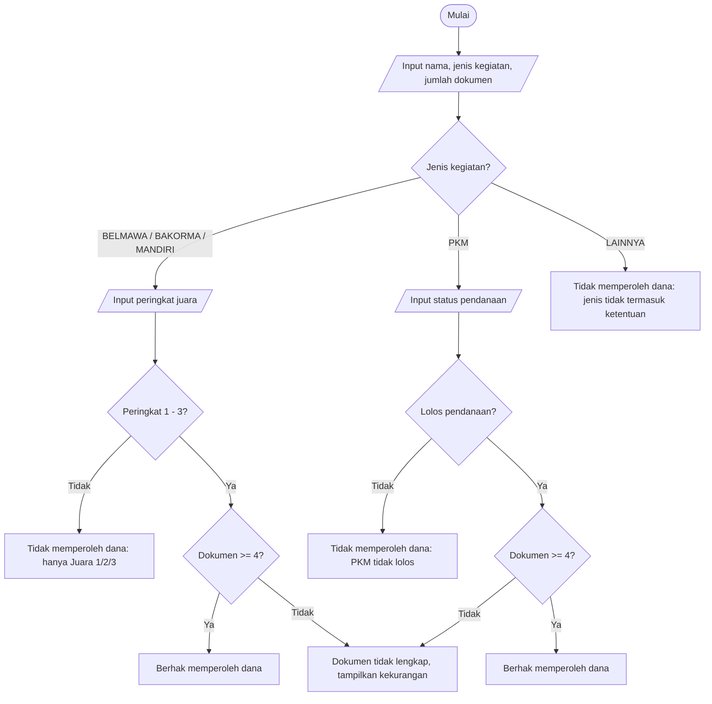

<div align="center">

# 🐙 JOBSHEET 6 — STUDI KASUS PEMILIHAN DENGAN GIT DAN GITHUB 🐙

**Praktikum Dasar Pemrograman 2026 · Politeknik Negeri Malang**

</div>

| | |
|---|---|
| 👤 **Nama** | Elia Beril |
| 🆔 **NIM** | 264107020027 |
| 🔢 **No. Presensi** | 13 |
| 📚 **Mata Kuliah** | Praktikum Dasar Pemrograman |
| 📝 **Materi** | Pemlihan Dengan Git & Github |
| ☕ **Bahasa** | Java |

> 📝 Dokumen ini memuat **Pertanyaan** (Percobaan 1–4) dan **Tugas**. Langkah-langkah praktikum tidak diulang. Semua hasil *run* berasal dari program yang benar-benar dijalankan. Langkah klik-klik Git/VS Code tidak diulang. Semua hasil *run* berasal dari program yang benar-benar dijalankan.

---

## 🗂️ Struktur Repository

```text
PraktikumDaspro13/
├── EliaBeril_Jobsheet_6_Git_GitHub.md             → identitas + hasil uji silang (Percobaan 1 & 4)
├── StudiKasus113.java                             → Studi Kasus 1: Kedai Kopi Senja (Percobaan 2)
└── StudiKasus213.java                             → Studi Kasus 2: Dana Penghargaan (Percobaan 3)
```

> 💡 Nama file mengikuti jobsheet: `StudiKasus1` + `13` → `StudiKasus113.java`, dan `StudiKasus2` + `13` → `StudiKasus213.java`. Nama `class` di dalam file harus sama persis.

## ✅ Checklist Commit & Push

| Urutan | Isi pekerjaan | Commit message | Push |
|:-:|---|---|:-:|
| 1 | Buat `README.md` berisi identitas | `Menambahkan identitas di README` | ✅ |
| 2 | `StudiKasus113.java` tahap 1 (input dan deklarasi variabel) | `SK1: input dan deklarasi variabel` | — |
| 3 | `StudiKasus113.java` tahap 2 (logika diskon dan kembalian) | `SK1: logika diskon dan kembalian` | ✅ |
| 4 | `StudiKasus213.java` tahap 1 (cabang lomba) | `SK2: cabang lomba` | — |
| 5 | `StudiKasus213.java` tahap 2 (cabang PKM dan Lainnya) | `SK2: cabang PKM dan lainnya` | ✅ |
| 6 | Hasil uji silang di `README.md` (Percobaan 4) | `Hasil uji SK2 oleh <Nama>` | ✅ |

> ⚠️ Tiap studi kasus butuh **minimal 2 commit**, jadi simpan kode **bertahap** (tahap 1, **Commit**, lanjut tahap 2, **Commit**, lalu **Push**). Jangan langsung menulis kode final lalu commit sekali.

---

# 1. Percobaan 1 — Menyiapkan Repository

📄 File: `README.md` (isi awal)

```markdown
Ini adalah repository pertama saya

- Nama  : Elia Beril
- NIM   : 264107020027
- Kelas : TI1D
```

> 💡 Kelas `TI1D` saya ambil dari nama file jobsheet sebelumnya. Ganti bila berbeda. Tanda `-` di awal baris dipakai supaya tiap baris tampil terpisah di GitHub (tanpa itu, tiga baris akan menyatu jadi satu paragraf).

**Commit message:** `Menambahkan identitas di README`

---

# 2. Percobaan 2 — Studi Kasus 1: Kedai Kopi Senja (Pemilihan Dasar)

📄 File: `StudiKasus113.java`

**Pemetaan flowchart ke kode:**

| Blok flowchart | Kode Java |
|---|---|
| Deklarasi `hargaPerCup = 18000`, `jumlahCup`, `uangBayar`, `totalHarga`, `diskon`, `totalBayar`, `kembalian`, `kurang` | deklarasi `int` di awal `main()` |
| Input `jumlahCup`, `uangBayar` | `sc.nextInt()` |
| `totalHarga = jumlahCup × hargaPerCup`, `diskon = 0` | perhitungan awal |
| Keputusan `totalHarga >= 100000 ?` (Ya → `diskon = totalHarga × 10 / 100`) | `if (totalHarga >= 100000) { ... }` tanpa `else` |
| `totalBayar = totalHarga − diskon`, cetak hasil | perhitungan dan `println` |
| Keputusan `uangBayar >= totalBayar ?` | `if ... else` → kembalian atau kurang |

### 🔹 Commit 1 — `SK1: input dan deklarasi variabel`

```java
// StudiKasus113.java
import java.util.Scanner;

public class StudiKasus113 {
    public static void main(String[] args) {
        Scanner sc = new Scanner(System.in);

        // Deklarasi variabel
        int hargaPerCup = 18000;
        int jumlahCup, uangBayar;
        int totalHarga, diskon, totalBayar;
        int kembalian, kurang;

        // Input
        System.out.print("Masukkan jumlah cup  : ");
        jumlahCup = sc.nextInt();
        System.out.print("Masukkan uang bayar  : ");
        uangBayar = sc.nextInt();
    }
}
```

### 🔹 Commit 2 — `SK1: logika diskon dan kembalian` (kode final)

```java
// StudiKasus113.java
import java.util.Scanner;

public class StudiKasus113 {
    public static void main(String[] args) {
        Scanner sc = new Scanner(System.in);

        // Deklarasi variabel
        int hargaPerCup = 18000;
        int jumlahCup, uangBayar;
        int totalHarga, diskon, totalBayar;
        int kembalian, kurang;

        // Input
        System.out.print("Masukkan jumlah cup  : ");
        jumlahCup = sc.nextInt();
        System.out.print("Masukkan uang bayar  : ");
        uangBayar = sc.nextInt();

        // Hitung total harga dan diskon
        totalHarga = jumlahCup * hargaPerCup;
        diskon = 0;

        if (totalHarga >= 100000) {
            diskon = totalHarga * 10 / 100;
        }

        totalBayar = totalHarga - diskon;

        System.out.println("Total harga          : Rp " + totalHarga);
        System.out.println("Diskon               : Rp " + diskon);
        System.out.println("Total bayar          : Rp " + totalBayar);

        // Cek pembayaran
        if (uangBayar >= totalBayar) {
            kembalian = uangBayar - totalBayar;
            System.out.println("Kembalian            : Rp " + kembalian);
        } else {
            kurang = totalBayar - uangBayar;
            System.out.println("Uang tidak cukup, kurang Rp " + kurang);
        }
    }
}
```

**Contoh hasil program (sama dengan contoh di jobsheet):**
```text
Masukkan jumlah cup  : 3
Masukkan uang bayar  : 50000
Total harga          : Rp 54000
Diskon               : Rp 0
Total bayar          : Rp 54000
Uang tidak cukup, kurang Rp 4000
```

**Hasil uji lain:**

| Cup | Uang bayar | Total harga | Diskon | Total bayar | Hasil |
|:-:|--:|--:|--:|--:|---|
| 3 | Rp50.000 | Rp54.000 | Rp0 | Rp54.000 | Uang tidak cukup, kurang Rp4.000 |
| 5 | Rp100.000 | Rp90.000 | Rp0 | Rp90.000 | Kembalian Rp10.000 |
| 6 | Rp100.000 | Rp108.000 | Rp10.800 | Rp97.200 | Kembalian Rp2.800 |
| 6 | Rp90.000 | Rp108.000 | Rp10.800 | Rp97.200 | Uang tidak cukup, kurang Rp7.200 |
| 10 | Rp200.000 | Rp180.000 | Rp18.000 | Rp162.000 | Kembalian Rp38.000 |

> 💡 Diskon 10% hanya berlaku bila total harga **≥ Rp100.000**. Karena harga per cup Rp18.000, diskon baru berlaku mulai **6 cup** (Rp108.000). Pembelian 5 cup (Rp90.000) belum mendapat diskon.

---

# 3. Percobaan 3 — Studi Kasus 2: Dana Penghargaan (Pemilihan Bersarang)

📄 File: `StudiKasus213.java`

**Peta keputusan** (kedalaman nested IF maksimal **3 tingkat**):



**Tingkat nested IF pada kode:**

| Tingkat | Cabang lomba | Cabang PKM |
|:-:|---|---|
| 1 | jenis = BELMAWA / BAKORMA / MANDIRI | jenis = PKM |
| 2 | peringkat 1 sampai 3? | status pendanaan = 1? |
| 3 | dokumen ≥ 4? | dokumen ≥ 4? |

**Poin penting:**
- **Hanya menanyakan data yang diperlukan.** Peringkat juara baru ditanya di dalam cabang lomba, dan status pendanaan baru ditanya di dalam cabang PKM. Untuk `Lainnya`, keduanya tidak ditanyakan.
- **Huruf besar/kecil tidak berpengaruh.** Jenis kegiatan diubah dengan `.trim().toUpperCase()` sebelum dibandingkan.
- **Syarat dokumen** (4 dokumen) hanya diperiksa bila kegiatan lolos ketentuan a atau b. Jumlah kekurangan dihitung dengan `4 - dokumen`.

### 🔹 Commit 1 — `SK2: cabang lomba`

```java
// StudiKasus213.java
import java.util.Scanner;

public class StudiKasus213 {
    public static void main(String[] args) {
        Scanner sc = new Scanner(System.in);

        System.out.print("Nama mahasiswa  : ");
        String nama = sc.nextLine();
        System.out.print("Jenis kegiatan (BELMAWA/BAKORMA/MANDIRI/PKM/LAINNYA) : ");
        String jenis = sc.nextLine().trim().toUpperCase();
        System.out.print("Jumlah dokumen  : ");
        int dokumen = sc.nextInt();

        String status;

        if (jenis.equals("BELMAWA") || jenis.equals("BAKORMA") || jenis.equals("MANDIRI")) {
            // Cabang perlombaan
            System.out.print("Peringkat juara : ");
            int peringkat = sc.nextInt();

            if (peringkat >= 1 && peringkat <= 3) {
                if (dokumen >= 4) {
                    status = "Berhak memperoleh dana penghargaan (Juara " + peringkat + ").";
                } else {
                    status = "Dokumen tidak lengkap (kurang " + (4 - dokumen) + " dokumen). Dana penghargaan tidak diberikan.";
                }
            } else {
                status = "Tidak memperoleh dana penghargaan (hanya untuk Juara 1/2/3).";
            }
        } else {
            status = "(cabang PKM dan Lainnya belum dibuat)";
        }

        System.out.println("Status : " + status);
    }
}
```

### 🔹 Commit 2 — `SK2: cabang PKM dan lainnya` (kode final)

```java
// StudiKasus213.java
import java.util.Scanner;

public class StudiKasus213 {
    public static void main(String[] args) {
        Scanner sc = new Scanner(System.in);

        System.out.print("Nama mahasiswa  : ");
        String nama = sc.nextLine();
        System.out.print("Jenis kegiatan (BELMAWA/BAKORMA/MANDIRI/PKM/LAINNYA) : ");
        String jenis = sc.nextLine().trim().toUpperCase();
        System.out.print("Jumlah dokumen  : ");
        int dokumen = sc.nextInt();

        String status;

        if (jenis.equals("BELMAWA") || jenis.equals("BAKORMA") || jenis.equals("MANDIRI")) {
            // Cabang perlombaan
            System.out.print("Peringkat juara : ");
            int peringkat = sc.nextInt();

            if (peringkat >= 1 && peringkat <= 3) {
                if (dokumen >= 4) {
                    status = "Berhak memperoleh dana penghargaan (Juara " + peringkat + ").";
                } else {
                    status = "Dokumen tidak lengkap (kurang " + (4 - dokumen) + " dokumen). Dana penghargaan tidak diberikan.";
                }
            } else {
                status = "Tidak memperoleh dana penghargaan (hanya untuk Juara 1/2/3).";
            }
        } else if (jenis.equals("PKM")) {
            // Cabang PKM
            System.out.print("Status pendanaan PKM (1=lolos, 0=tidak lolos) : ");
            int pendanaan = sc.nextInt();

            if (pendanaan == 1) {
                if (dokumen >= 4) {
                    status = "Berhak memperoleh dana penghargaan (PKM lolos pendanaan).";
                } else {
                    status = "Dokumen tidak lengkap (kurang " + (4 - dokumen) + " dokumen). Dana penghargaan tidak diberikan.";
                }
            } else {
                status = "Tidak memperoleh dana penghargaan (PKM tidak lolos pendanaan).";
            }
        } else if (jenis.equals("LAINNYA")) {
            // Cabang Lainnya
            status = "Tidak memperoleh dana penghargaan (jenis kegiatan tidak termasuk ketentuan).";
        } else {
            status = "Jenis kegiatan tidak valid.";
        }

        System.out.println("Status : " + status);
    }
}
```

**Contoh hasil program (sama dengan contoh di jobsheet):**
```text
Nama mahasiswa  : Dori
Jenis kegiatan (BELMAWA/BAKORMA/MANDIRI/PKM/LAINNYA) : bakorma
Jumlah dokumen  : 3
Peringkat juara : 1
Status : Dokumen tidak lengkap (kurang 1 dokumen). Dana penghargaan tidak diberikan.
```

**Hasil uji untuk setiap jalur keputusan:**

| # | Nama | Jenis | Dokumen | Peringkat / Pendanaan | Status |
|:-:|---|---|:-:|:-:|---|
| 1 | Dori | bakorma | 3 | 1 | Dokumen tidak lengkap (kurang 1 dokumen). Dana penghargaan tidak diberikan. |
| 2 | Budi | Mandiri | 4 | 0 | Tidak memperoleh dana penghargaan (hanya untuk Juara 1/2/3). |
| 3 | Sari | pkm | 4 | 1 | Berhak memperoleh dana penghargaan (PKM lolos pendanaan). |
| 4 | Rina | Lainnya | 4 | (tidak ditanyakan) | Tidak memperoleh dana penghargaan (jenis kegiatan tidak termasuk ketentuan). |
| 5 | Andi | BELMAWA | 4 | 3 | Berhak memperoleh dana penghargaan (Juara 3). |
| 6 | Maya | PKM | 4 | 0 | Tidak memperoleh dana penghargaan (PKM tidak lolos pendanaan). |
| 7 | Tono | pkm | 2 | 1 | Dokumen tidak lengkap (kurang 2 dokumen). Dana penghargaan tidak diberikan. |
| 8 | Eka | Belmawa | 0 | 2 | Dokumen tidak lengkap (kurang 4 dokumen). Dana penghargaan tidak diberikan. |
| 9 | Fani | olahraga | 4 | (tidak ditanyakan) | Jenis kegiatan tidak valid. |

---

# 4. Percobaan 4 — Uji Silang Program Teman

Bagian ini dikerjakan **berpasangan dan bergantian**. Hasil ujinya ditulis di bagian bawah `README.md` pada repository **pemilik program**, dengan format dari jobsheet.

📄 File: `README.md` (isi akhir setelah hasil uji ditambahkan)

```markdown
Ini adalah repository pertama saya

- Nama  : Elia Beril
- NIM   : 264107020027
- Kelas : TI1D

## Hasil Uji Studi Kasus 2 oleh <Nama Penguji>

| No | Jenis | Dokumen | Juara/Dana | Output | Sesuai? |
|----|-------|---------|------------|--------|---------|
| 1 | BAKORMA | 3 | Juara 1 | Dokumen tidak lengkap (kurang 1 dokumen). Dana penghargaan tidak diberikan. | Ya |
| 2 | Mandiri | 4 | 0 (bukan juara) | Tidak memperoleh dana penghargaan (hanya untuk Juara 1/2/3). | Ya |
| 3 | pkm | 4 | 1 (lolos) | Berhak memperoleh dana penghargaan (PKM lolos pendanaan). | Ya |
| 4 | Lainnya | 4 | (tidak ditanyakan) | Tidak memperoleh dana penghargaan (jenis kegiatan tidak termasuk ketentuan). | Ya |
```

> ⚠️ **Tabel di atas berisi hasil dari program saya sendiri** (sebagai contoh isian dan acuan jawaban benar). Saat **menguji program teman**, jalankan `StudiKasus2<NoPresensi>.java` milik teman dengan data uji yang sama, lalu tulis **output sebenarnya dari program teman** di kolom *Output*. Isi kolom *Sesuai?* dengan `Ya` bila outputnya sama dengan **Output yang diharapkan** di jobsheet, atau `Tidak` bila berbeda. Ganti `<Nama Penguji>` dengan namamu.

**Output yang diharapkan** (acuan untuk kolom *Sesuai?*):

| Jenis | Dokumen | Peringkat / Pendanaan | Output yang diharapkan |
|---|:-:|---|---|
| BAKORMA | 3 | Juara 1 | Dokumen tidak lengkap (kurang 1 dokumen). Dana penghargaan tidak diberikan. |
| Mandiri | 4 | 0 (bukan juara) | Tidak memperoleh dana penghargaan (hanya untuk Juara 1/2/3). |
| pkm | 4 | 1 (lolos) | Berhak memperoleh dana penghargaan (PKM lolos pendanaan). |
| Lainnya | 4 | (tidak ditanyakan) | Tidak memperoleh dana penghargaan (jenis kegiatan tidak termasuk ketentuan). |

**Commit message:** `Hasil uji SK2 oleh <Nama>`

> 💡 **Aturan kolaborasi:** pemilik repository melakukan **Pull** dulu sebelum mengubah `README.md`, supaya tidak terjadi konflik karena dua orang mengubah file yang sama.

---

# 5. Catatan

- Contoh hasil program pada kedua studi kasus sudah dicocokkan dengan contoh di jobsheet, dan hasilnya sama.
- `Kelas : TI1D` pada README diambil dari nama file jobsheet sebelumnya, jadi ganti bila tidak sesuai.
- Jika jenis kegiatan yang diketik tidak termasuk lima pilihan (BELMAWA, BAKORMA, Mandiri, PKM, Lainnya), program menampilkan **"Jenis kegiatan tidak valid."** Penanganan ini tambahan dari saya dan tidak diminta jobsheet.
- Jumlah dokumen diasumsikan 0–4 sesuai ketentuan isian. Program tidak memvalidasi angka di luar rentang itu.

<div align="center">

— *Elia Beril · 264107020027* —

</div>
